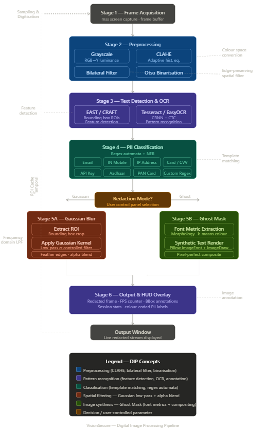

# DIGITAL IMAGE PROCESSING

  

Your screen is a live video. VisionSecure grabs that video frame by frame, reads the text in each frame, finds private information, hides it, and shows you the clean output -all in real time, fast enough to use during a Google Meet.

**Stage 1 -Frame Acquisition (the grey box at the top)**

The app takes a "screenshot" of your screen many times per second -this is called capturing a frame. Each frame is just a grid of colored dots (pixels). This is the "Sampling and Digitization" step in DIP - you are converting the continuous real world (your live screen) into a discrete digital image made of numbers.

**Stage 2 -Preprocessing (the blue box)**

Raw screenshots are messy. Before reading text from them, you clean and sharpen the image. Four things happen here:

**Grayscale** -You throw away color information and keep only brightness. Why? OCR (text reading) does not need color, and working with one number per pixel instead of three (Red, Green, Blue) is three times faster. The formula used is the standard luminance formula which weights green the most because human eyes are most sensitive to it.

**CLAHE** -stands for _Contrast Limited Adaptive Histogram Equalization_. A histogram here means a chart of how many pixels are bright vs dark. CLAHE adjusts the brightness locally -meaning if one part of your screen is very dark (like a terminal window) and another is very bright (like a Word document), it makes the text in both regions equally crisp. Without this, OCR would miss text in dark regions.

**Bilateral Filter** -A type of blur, but a smart one. Normal blur smears everything including the edges of letters. The bilateral filter blurs only the flat background areas (the noise) while keeping the sharp edges of text letters intact. This makes letters crisp for OCR while removing pixel-level graininess.

**Otsu Binarization** -_Binarization_ means converting the image to pure black and white -every pixel becomes either 0 (black) or 1 (white). Otsu's method automatically finds the best cutoff brightness value to do this without you having to set it manually. After this step, text pixels are white and background pixels are black, which is the ideal input for an OCR engine.

**Stage 3 -Text Detection and OCR (the purple box)**

Two things happen in sequence:

**EAST / CRAFT detector** -these are deep learning models that scan the image and draw bounding boxes around regions that contain text. A _bounding box_ is just a rectangle drawn tightly around a word or line of text. _EAST_ stands for _Efficient and Accurate Scene Text_, and _CRAFT_ stands for _Character Region Awareness for Text Detection_. They answer the question: "where on the screen is there text?"

**Tesseract / EasyOCR** -once you know where the text is, these engines read what the text actually says. Tesseract is Google's open-source OCR engine. EasyOCR uses a _CRNN_ (_Convolutional Recurrent Neural Network_) combined with _CTC loss_ (_Connectionist Temporal Classification_) -basically a neural network that reads sequences of characters left to right. They answer the question: "what does that text say?"

**Stage 4 -PII Classification (the teal box)**

_PII_ stands for _Personally Identifiable Information_ -any data that could reveal who you are or expose your private accounts.

Now that you have the text from the screen, you scan it using regex patterns. A _regex_ (_Regular Expression_) is essentially a search rule -for example, the rule "find any 10-digit number starting with 6, 7, 8, or 9" detects Indian mobile numbers. Each PII type has its own rule:

*   Email: looks for the @ symbol pattern
*   Indian mobile: looks for 10-digit numbers starting with 6-9, optionally preceded by +91
*   IP address: looks for four numbers separated by dots (like 192.168.1.1) -_IP_ stands for _Internet Protocol_
*   Credit card: looks for 16-digit numbers and validates them using the Luhn algorithm (a mathematical checksum)
*   CVV: stands for _Card Verification Value_ -the 3 or 4 digit security code on a card
*   API key: stands for _Application Programming Interface key_ -long alphanumeric strings used to authenticate software
*   Aadhaar: the 12-digit Indian national ID number
*   PAN card: stands for _Permanent Account Number_ -the Indian tax ID in the format AAAAA9999A
*   Custom: the user can type their own pattern into the GUI

**The Amber Decision Diamond -Redaction Mode?**

This is where the user's choice from the control panel takes effect. The pipeline splits into two paths depending on which mode is selected.

**Stage 5A -Gaussian Blur (the coral/red box, left path)**

This is the "safe but visible" redaction. Three steps:

**Extract ROI** -_ROI_ stands for _Region of Interest_. It just means the rectangular patch of the image that contains the sensitive text. The system crops that rectangle out of the full frame.

**Apply Gaussian Kernel** -a _kernel_ is a small matrix of numbers that slides over the image and replaces each pixel with a weighted average of its neighbours. The Gaussian kernel uses a bell-curve shaped weighting, so nearby pixels matter more than distant ones. This smears the text into an unreadable blur. _Sigma_ (σ) controls how strong the blur is -the user adjusts this with a slider in the GUI, which directly changes the cutoff frequency of the low-pass filter.

**Feather edges** -after pasting the blurred patch back onto the frame, the edges of the rectangle would look like a hard ugly box. Feathering applies a gentle gradient at the boundary (using alpha blending -alpha, α, is just a transparency value from 0 to 1) so the blur fades smoothly into the surrounding image and looks natural.

**Stage 5B -Ghost Mask (the green box, right path)**

This is the "invisible" redaction from your project proposal. The original text is replaced with fake-but-realistic text that matches the visual style of the original, so the screen looks completely normal to remote viewers.

**Font Metric Extraction** -the system analyses the pixels of the detected text region to figure out: how tall the letters are, how thick the strokes are (using morphological erosion -you shrink the letters step by step until they disappear, and count how many steps that took), and what colour the text is (using k-means clustering -a simple algorithm that groups similar pixel colours together). These measurements are called font metrics.

**Synthetic Text Render** -using the font metrics extracted above, the system generates a replacement string (like masking sabhya@gmail.com to s\*\*\*\*\*@gmail.com) and renders it using Pillow's ImageFont and ImageDraw tools, matching the original font size, weight, and colour.

**Pixel-perfect composite** -the rendered fake text is pasted onto the original background pixels of that region. Because the font and colour match, nobody looking at the output can tell anything was changed.

**Stage 6 -Output and HUD Overlay (the second purple box)**

The processed frame -with all sensitive regions either blurred or ghost-masked -is displayed in the output window. On top of the frame, the system draws a _HUD_ (_Heads-Up Display_), just like in a video game:

*   FPS (_Frames Per Second_) -how fast the pipeline is running
*   How many redactions happened in this frame
*   Total redactions in the session
*   Colour-coded bounding boxes around each detected PII region (red for email, orange for phone, yellow for IP, etc.)

**The Dashed Loop on the Left -Temporal ROI Cache**

This is the performance optimisation. Most of the time, your screen doesn't change much between consecutive frames -if you have a static email address sitting on screen, it doesn't move. The system remembers where it found PII in the previous frame and reuses that information for the next frame without re-running OCR. It only re-processes a region when the pixels actually change. This is what keeps the FPS high despite all the processing happening under the hood.